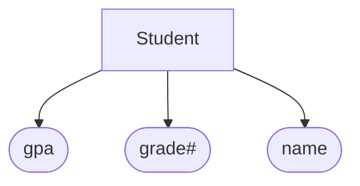
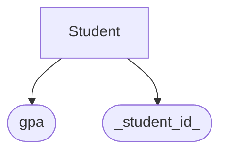
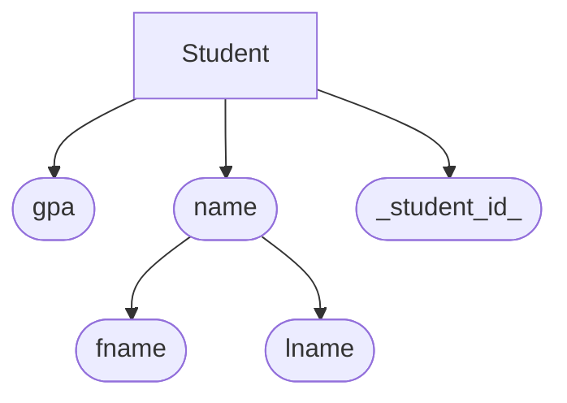
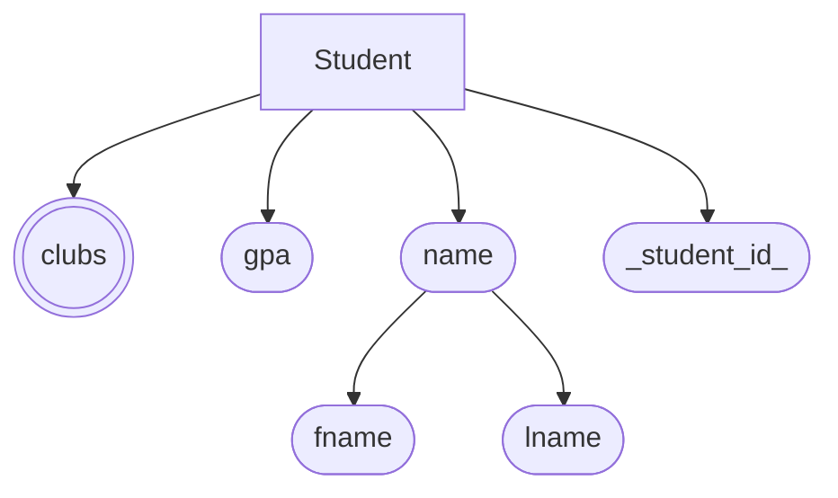
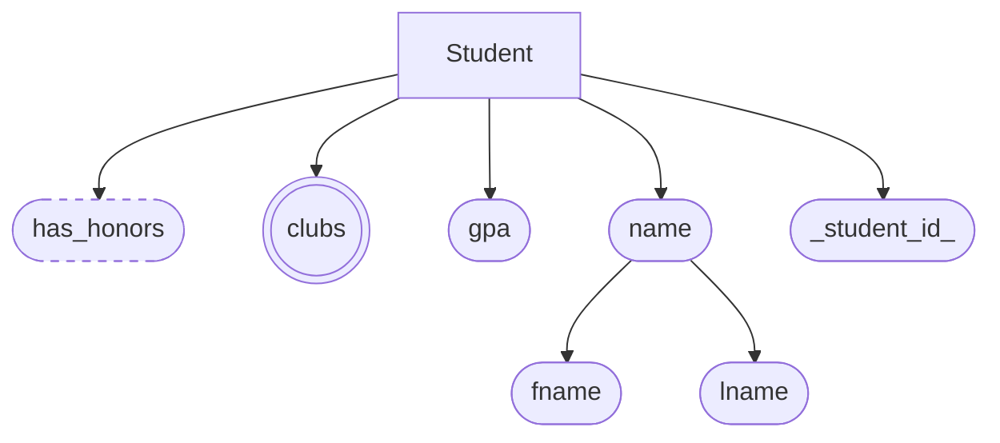
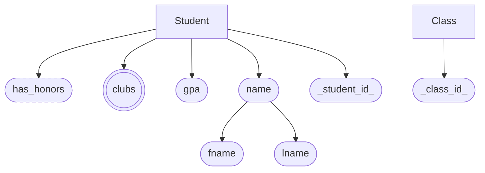
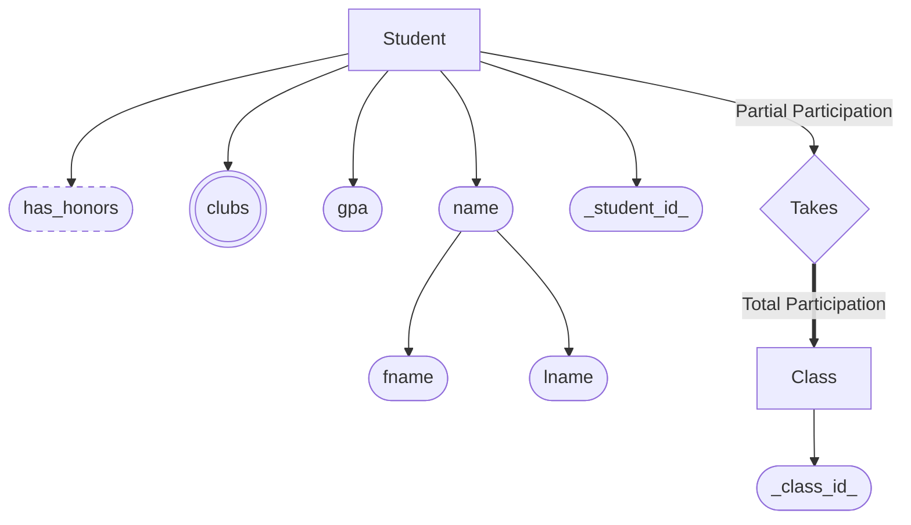
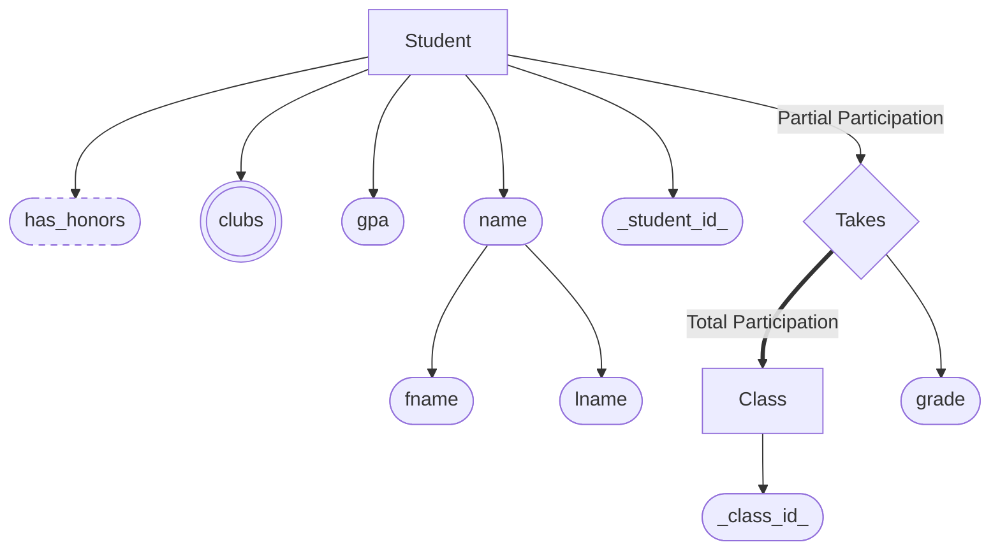
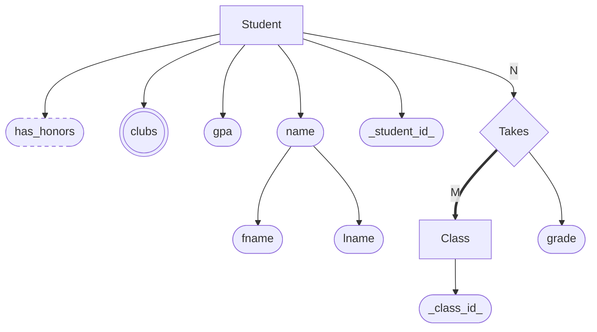
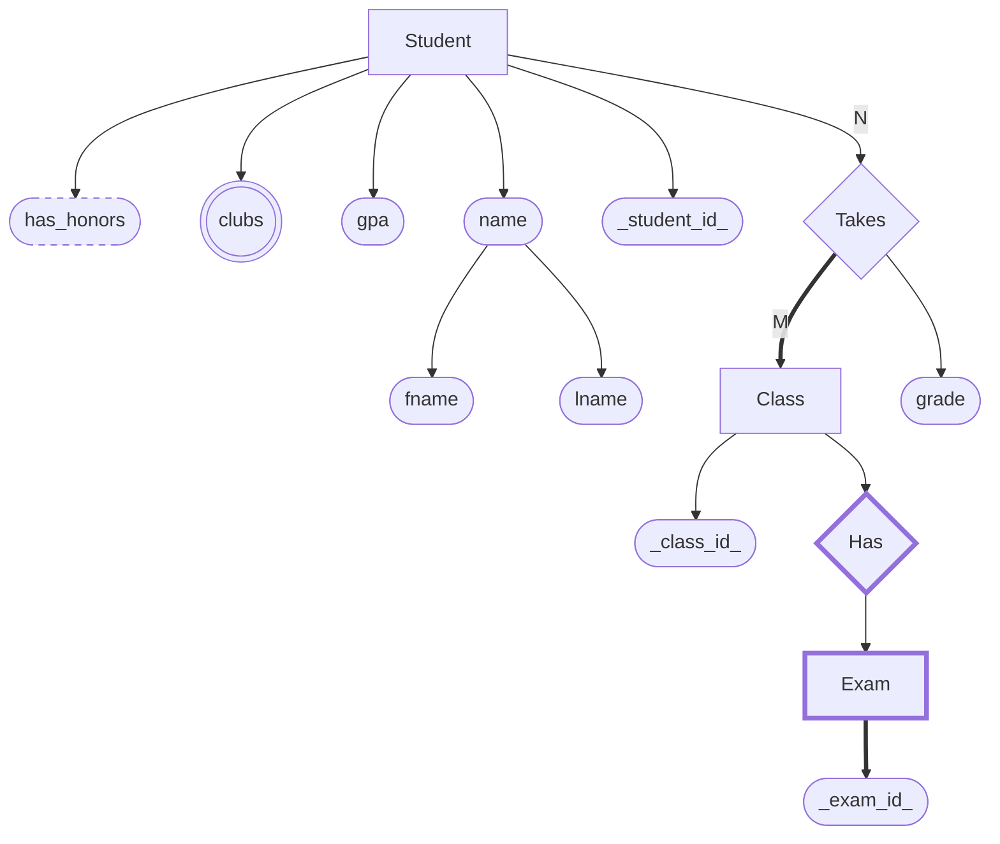

O SQL é uma linguagem estruturada de consulta em bancos relacionais (organização em tabelas), porque permite relacionar os tipos de dados na tabela.

O *CRUD* é uma de suas principais funções sendo ele:

> **C**reate / Insert
> **R**ead / Select
> **U**pdate
> **D**elete

Ela permite adicionar, remover e modificar dados, sem interromper o fluxo.

# Benefícios

**Alto desempenho**. Por ser bem otimizado o banco de dados relacionais podem lidar com uma grande quantidade de dados rapidamente

**Facilidade de uso**. O SQL é escrita em inglês, desta maneira permanece simple seu entendimento. Ela também permite migração fácil entre sistemas SQL.

## ACID

O ACID (Atomicidade, Consistência, Isolamento e Durabilidade), garante a integridade dos dados.

**Atomicidade**: garante que todas as partes de uma sequência de operação (transação) sejam concluídas ou que nenhuma seja concluída.

**Consistência**: garante que as transações levem o banco de dados de um estado válido para outro.

**Isolamento**: impede que as transações se interfiram.

**Durabilidade**: garante que, uma vez confirmada, uma transação seja salva permanentemente, mesmo em caso de falha do sistema.

# RDBMS (Sistema de Gerenciamento de Banco de Dados Relacional)

SQL é somente a linguagem que interagem com estes bancos de dados, o que acontece é que estamos interagindo com os Sistemas de Gerenciamento de Banco de Dados (RDBMS). São eles por exemplo:

**MySQL**: oferece replicação, particionamento e vários mecanismos de armazenamento para otimizar as workloads.

**PostgreSQL**: é um sistema de banco de dados relacional de objetos de código aberto que estende a linguagem SQL com recursos adicionais, incluindo suporte para JSON, XML e tipos de dados personalizados.

**Microsoft SQL Server**: oferece processamento na memória, analytics avançadas e alta disponibilidade por meio de grupos de disponibilidade Always On.

**Oracle Database**: ele é conhecido por seus recursos de escalabilidade, desempenho e segurança. A Oracle suporta muitos modelos de dados, incluindo armazenamentos relacionais, de documentos, gráficos e de valores-chave. Ele oferece recursos como Real Application Clusters (RAC), Gerenciamento automático do armazenamento (ASM) e opções de segurança de dados.

**MariaDB**: é um fork do MySQL criado pelos desenvolvedores originais depois que a Oracle o adquiriu. Ele introduziu várias melhorias, incluindo novos mecanismos de armazenamento e recursos adicionais, como suporte a JSON, colunas dinâmicas e pool de threads.

# Non-SQL

==Pesquisar mais sobre==

# Tipos

Os tipos mais comuns de tipos de datas são:

**INT**. Números inteiros.

**DECIMAL(M,N)**. Números Decimais, onde **M** é a quantidade de números antes da vírgula e **N** é a quantidade de números depois da vírgula.

**VARCHAR(5)**. Guarda um *String* de até o caractere do tamanho determinado, no caso 5, ou seja, até 5 caracteres.

**BLOB (Binary Large Object)**. Guarda grandes quantidades de dados em binário ( Ex. Imagens, arquivos) 

**DATE**. Guarda a data organizada em: YYYY-MM-DD (Ano, mês, dia).

**TIMESTAMP**. Parecida com *DATE* mas permite guardar a hora, minuto e segundo: YYYY-MM-DD HH:MM.SS, é mais utilizado quando se precisa recordar algum evento.

# Comandos

Para exemplificar será criado uma tabela de estudantes com o id, nome e matéria. 

Criar uma tabela:

```mysql
CREATE TABLE student ();
```

Adicionar colunas, tipo e tipo de chave, em ordem:

```mysql
CREATE TABLE student (
	student_id INT PRIMARY KEY,
    name VARCHAR(20),
    major  VARCHAR(20)
);
```

Descrever os detalhes das colunas da tabela:

```mysql
DESCRIBE student;
```

Apagar uma tabela:

```mysql
DROP TABLE student;
```

Alterar uma tabela:

```mysql
ALTER TABLE student ADD gpa DECIMAL(3, 2);
```

Inserir dados:

```mysql
INSERT INTO student VALUES(1, 'Eduardo', 'Engenharia Civil');
```

Inserir apenas dados específicos:

```mysql
INSERT INTO student(student_id, name) VALUES(2, 'Adrian');
```

Outra maneira de especificar a chave primária:

```mysql
CREATE TABLE student (
	student_id INT,
    name VARCHAR(20),
    major  VARCHAR(20),
    PRIMARY KEY(student_id)
);
```

## Constraints

Dizer qual tal dado não pode ser nulo:

```mysql
CREATE TABLE student (
	student_id INT NOT NULL,
    name VARCHAR(20),
    major VARCHAR(20),
    PRIMARY KEY(student_id)
);
```

Dizer qual dado tem de ser único (não repete):

```mysql
CREATE TABLE student (
	student_id INT NOT NULL,
    name VARCHAR(20) NOT NULL,
    major VARCHAR(30) UNIQUE,
    PRIMARY KEY(student_id)
);
```

Uma chave primária é algo que não é nula e que também é único.

Inserir um valor padrão:

```mysql
CREATE TABLE student (
	student_id INT,
    name VARCHAR(20),
    major VARCHAR(30) DEFAULT 'Não decidido',
    PRIMARY KEY(student_id)
);

INSERT INTO student(student_id, name) VALUES(5, 'Richard'); -- Não necessário inserir major

SELECT * FROM student;
```

Para adicionar um valor automático:

```mysql
CREATE TABLE student (
	student_id INT AUTO_INCREMENT,
    name VARCHAR(20),
    major VARCHAR(30) DEFAULT 'Não decidido',
    PRIMARY KEY(student_id)
);

INSERT INTO student(name, major) VALUES('Kauã', 'Educação Física');
```

## Atualizar e Deletar 

Se quisermos atualizar nossa tabela de estudantes e mudar o nome da matéria 'Ciência da Computação' para 'Ciência Comp.' faremos:

```mysql
UPDATE student
SET major = 'Ciênca Comp.'
WHERE major = 'Ciência da Computação';
```

O **WHERE** é muito importante para especificar o que tem de ser mudado, caso contrário, toda tabela seria alterada. 

Tudo pode ser feito em uma linha.

Comparações possíveis:

- = (igual);
- <> (diferente);
- \> (maior que);
- < (menor que);
- \>= (maior ou igual);
- <= (menor ou igual).

Também é possível alterar através de outros dados, como:

1:

```mysql
UPDATE student
SET major = 'Ciênca Comp.'
WHERE student_id = 3;
```

2:

```mysql
UPDATE student
SET major = 'Engenharia'
WHERE major = 'Física' OR major = 'Engenharia Civil';
```

3:

```mysql
UPDATE student
SET name = 'Erick', major = 'Não decidido'
WHERE student_id = 1;
```

Para deletar faremos de forma semelhante:

```mysql
DELETE FROM student
WHERE name = 'Adrian' AND major = 'Não decidido';
```

Deletar tudo:

```mysql
DELETE FROM student;
```

## Queries Básicas

Também podemos filtrar o conteúdo que queremos pedir a tabela com o **SELECT**.

Como o **\*** significa todas as colunas, podemos então no lugar dele selecionar as colunas que desejamos filtrar:

```mysql
SELECT student_id, name
FROM student;
```

Para selecionar uma ordenação utilizamos o **ORDER**:

```mysql
SELECT student_id, name
FROM student
ORDER BY name;
```

Por padrão é crescente, mas também podemos alterar adicionando **DESC**() em seguida.

Independentemente se esta filtrando por determinados dados, pode-se organizar por outros:

```mysql
SELECT student_id, name
FROM student
ORDER BY major;
```

Caso haja dois casos semelhantes na ordenação, é possível escolher dois tipos de ordenação ao mesmo tempo, logo, se estamos ordenando por *major* dentre duas pessoa de mesma *major* a prioridade será o outro tipo de ordenação.

```mysql
SELECT student_id, name
FROM student
ORDER BY major, student_id;
```

Para limitar uma quantidade faremos isto com o **LIMIT**:

```mysql
SELECT student_id, name
FROM student
ORDER BY major, student_id
LIMIT 3;
```

No caso de vários valores a serem buscados ao mesmo tempo, podemos utilizar o **IN**, basicamente uma lista da valores no qual retorna o que for pedido dentre os itens nela:

```mysql
SELECT name, major
FROM student
WHERE name IN ('Adrian', 'Erick', 'Richard', 'Eduardo');
```

Sabendo disso tudo é possível junta-los e aumentar o nível de complexidade para um resultado mais específico:

```mysql
SELECT name, major
FROM student
WHERE major <> 'Odontologia' AND student_id <= 4
ORDER BY student_id ASC
LIMIT 3;
```

## Tabela 2

A partir de agora iremos criar uma nova tabela com um grau maior de complexidade seguindo [esta estrutura](https://www.giraffeacademy.com/databases/sql/company-database.pdf). [Explicação](https://www.youtube.com/watch?v=HXV3zeQKqGY&t=7717s)

Criando a tabela *employee*:

```mysql
CREATE TABLE employee (
emp_id INT PRIMARY KEY,
first_name VARCHAR(35),
last_name VARCHAR(35),
birth_date DATE,
sex VARCHAR(1),
salary INT,
super_id INT,
branch_id INT
);
```

As colunas `super_id` e `branch_id` serão chaves estrangeira, mas como essas tabelas ainda não existem, não é possível torna-las em chaves estrangeiras.

Criando a tabela de *branch*:

```mysql
CREATE TABLE branch (
branch_id INT PRIMARY KEY,
branch_name VARCHAR(40),
mgr_id INT,
mgr_start_date DATE,
FOREIGN KEY(mgr_id) REFERENCES employee (emp_id) ON DELETE SET NULL
);
```

A chave estrangeira se referencia ao *id* do empresário, que caso deletado, torna-se nulo.

Agora que já temos duas das tabelas podemos inserir as chaves primárias na primeira tabela:

```mysql
ALTER TABLE employee
ADD FOREIGN KEY(branch_id)
REFERENCES branch(branch_id)
ON DELETE SET NULL;

ALTER TABLE employee
ADD FOREIGN KEY(super_id)
REFERENCES employee(emp_id)
ON DELETE SET NULL;
```

Criando a tabela *client*:

```mysql
CREATE TABLE client (
client_id INT PRIMARY KEY,
client_name VARCHAR(40),
branch_id INT,
FOREIGN KEY(branch_id) REFERENCES branch(branch_id) ON DELETE SET NULL
);
```

Criando a tabela *works_with*:

```mysql
CREATE TABLE works_with (
emp_id INT,
client_id INT,
total_sales INT,
PRIMARY KEY(emp_id, client_id),
FOREIGN KEY(emp_id) REFERENCES employee(emp_id) ON DELETE CASCADE,
FOREIGN KEY(client_id) REFERENCES client(client_id) ON DELETE CASCADE
);
```

Neste caso as duas primárias serão também chaves estrangeiras.

E por último a tabela de *branch_supplier*:

```mysql
CREATE TABLE branch_supplier (
branch_id INT,
supplier_name VARCHAR(35),
supply_type VARCHAR(35),
PRIMARY KEY(branch_id, supplier_name),
FOREIGN KEY(branch_id) REFERENCES branch(branch_id) ON DELETE CASCADE
);
```

Inserindo valores na tabela *client* e *branch*:

```mysql
INSERT INTO employee VALUES (100, 'Adrian', 'Goulart', '1967-11-17', 'M', 250000, NULL, NULL);

INSERT INTO branch VALUES (1, 'Comporate', 100, '2006-02-09');

UPDATE employee
SET branch_id = 1
WHERE emp_id = 100;

INSERT INTO employee VALUES(101, 'Jan', 'Levinson', '1961-05-11', 'M', 110000, 100, 1);
```

Primeiramente adicionamos um row a *employee*, no caso de *super_id* e *branch_id* são nulos porque eles ainda não existem. Após isto adicionamos um row na *branch*. Agora atualizamos o empregado que antes não havia uma *branch_id* e em seguida inserimos mais um row na tabela *employee*.

Segundo row da *branch*(Scranton), mesma lógica:

```mysql
INSERT INTO employee VALUES(102, 'Michael', 'Scott', '1964-03-15', 'M', 75000, 100, NULL);

INSERT INTO branch VALUES(2, 'Scranton', 102, '1992-04-06');

UPDATE employee
SET branch_id = 2
WHERE emp_id = 102;

INSERT INTO employee VALUES(103, 'Angela', 'Martin', '1971-06-25', 'F', 63000, 102, 2);
INSERT INTO employee VALUES(104, 'Kelly', 'Kapoor', '1980-02-05', 'F', 55000, 102, 2);
INSERT INTO employee VALUES(105, 'Stanley', 'Hudson', '1958-02-19', 'M', 69000, 102, 2);
```

Terceiro row da *branch*(Stamford), mesma lógica:

```mysql
INSERT INTO employee VALUES(106, 'Josh', 'Porter', '1969-09-05', 'M', 78000, 100, NULL);

INSERT INTO branch VALUES(3, 'Stamford', 106, '1998-02-13');

UPDATE employee
SET branch_id = 3
WHERE emp_id = 106;

INSERT INTO employee VALUES(107, 'Andy', 'Bernard', '1973-07-22', 'M', 65000, 106, 3);
INSERT INTO employee VALUES(108, 'Jim', 'Halpert', '1978-10-01', 'M', 71000, 106, 3);
```

Inserindo informações em *branch_supplier*:

```mysql
INSERT INTO branch_supplier VALUES(2, 'Hammer Mill', 'Paper');
INSERT INTO branch_supplier VALUES(2, 'Uni-ball', 'Writing Utensils');
INSERT INTO branch_supplier VALUES(3, 'Patriot Paper', 'Paper');
INSERT INTO branch_supplier VALUES(2, 'J.T. Forms & Labels', 'Custom Forms');
INSERT INTO branch_supplier VALUES(3, 'Uni-ball', 'Writing Utensils');
INSERT INTO branch_supplier VALUES(3, 'Hammer Mill', 'Paper');
INSERT INTO branch_supplier VALUES(3, 'Stamford Lables', 'Custom Forms');
```

Inserindo informações em *client*:

```mysql
INSERT INTO client VALUES(400, 'Dunmore Highschool', 2);
INSERT INTO client VALUES(401, 'Lackawana Country', 2);
INSERT INTO client VALUES(402, 'FedEx', 3);
INSERT INTO client VALUES(403, 'John Daly Law, LLC', 3);
INSERT INTO client VALUES(404, 'Scranton Whitepages', 2);
INSERT INTO client VALUES(405, 'Times Newspaper', 3);
INSERT INTO client VALUES(406, 'FedEx', 2);
```

Inserindo informações em *works_with*:

```mysql
INSERT INTO works_with VALUES(105, 400, 55000);
INSERT INTO works_with VALUES(102, 401, 267000);
INSERT INTO works_with VALUES(108, 402, 22500);
INSERT INTO works_with VALUES(107, 403, 5000);
INSERT INTO works_with VALUES(108, 403, 12000);
INSERT INTO works_with VALUES(105, 404, 33000);
INSERT INTO works_with VALUES(107, 405, 26000);
INSERT INTO works_with VALUES(102, 406, 15000);
INSERT INTO works_with VALUES(105, 406, 130000);
```

### Mais Queries Básicas

Achar todos os empregado ordenados por salário:

```mysql
SELECT * FROM employee
ORDER BY salary DESC;
```

Achar todos os empregado ordenados por gênero e nome:

```mysql
SELECT * FROM employee
ORDER BY sex, first_name;
```

Achar todos os 5 primeiros empregados:

```mysql
SELECT * FROM employee
ORDER BY birth_date ASC
LIMIT 5;
```

Achar o primeiro e último nome dos empregados:

```mysql
SELECT first_name, last_name FROM employee;
```

Para mudar a aparência do nome da colunas aparecendo nas tabelas usamos o **AS**:

```mysql
SELECT first_name AS forename, last_name AS surname FROM employee;
```

Para achar valores diferentes de uma coluna, usamos o **DISTINCT**:

```mysql
SELECT DISTINCT sex FROM employee;
```

### Funções

Se desejarmos contar quantos elementos há em uma coluna, usa-se o **COUNT**:

```mysql
SELECT COUNT(emp_id)
FROM employee;
```

Para procurar todas as empregadas nascidas depois de 1970:

```mysql
SELECT COUNT(emp_id)
FROM employee
WHERE sex = 'F' AND birth_date >= '1970-01-01';
```

Achar a média de alguma coluna com **AVG**:

```mysql
SELECT AVG(salary)
FROM employee;
```

Achar a soma de uma coluna com **SUM**:

```mysql
SELECT SUM(salary)
FROM employee;
```

Se quisermos contar valores e/ou agrupa-los, utilizamos o **GROUP BY** (Aggregation):

```mysql
SELECT COUNT(sex), sex
FROM employee
GROUP BY sex;
```

Basicamente irá contar e selecionar os gêneros da tabela *employee* e agrupar-los por diferentes valores.

Para achar o total de vendas de cada vendedor:

```mysql
SELECT SUM(total_sales), emp_id
FROM works_with
GROUP BY emp_id;
```

Para checar o quanto o cliente gastou:

```mysql
SELECT SUM(total_sales), client_id
FROM works_with
GROUP BY client_id;
```

## Wildcards

Para procurar algum padrão específico, por exemplo, um nome de um cliente no qual contenha "LLC". Para isto usamos o **LIKE** (for como), juntamente dele temos dois caracteres especiais, o '%' e '\_'. O caractere '%' é para qualquer quantidade de caractere e o '\_' é para apenas um caractere.

```mysql
SELECT *
FROM client
WHERE client_name LIKE '%LLC';
```

Desta forma ele irá selecionar todos da tabela de clientes onde o nome do cliente *for como* (qualquer caractere **antes**)LLC.

```mysql
SELECT *
FROM client
WHERE client_name LIKE '%News%';
```

Agora retornará qualquer coisa no qual contenha algo **ANTES** e **DEPOIS** de '*News*'.

Podemos misturar isto com outras coisas também, por exemplo, caso deseje selecionar todas pessoas que nasceram no mês de outubro fazemos:

```mysql
SELECT *
FROM employee
WHERE birth_date LIKE '%-10-%';
```

Há várias formas de como poderíamos definir o padrão: '\_\_\_\_-10%', '\_\_\_\_\_10\_\_\_', '%10%'.

## Union

Se quisermos achar uma lista de empregados e nomes da *branch*, utilizamos o **UNION**:

```mysql
SELECT first_name
FROM employee
UNION
SELECT branch_name
FROM branch;
```

Desta forma retornará os dois dados selecionados em uma coluna.

Para utilizar o **UNION** temos algumas regras:

1. O número de colunas selecionadas devem ser iguais.
2. As colunas selecionadas devem conter tipos de dados similares.

É possível utilizar continuamente o **UNION**, também vale lembrar que o nome da coluna é igual a primeira expressão (SELECT), portanto podemos muda-lá com **AS**:

```mysql
SELECT first_name AS company_names
FROM employee
UNION
SELECT branch_name
FROM branch
UNION
SELECT client_name
FROM client;
```

Para coletar todos os nome e IDs das tabelas *clients* e *branch_suppliers*:

```mysql
SELECT client_name, branch_id
FROM client
UNION
SELECT supplier_name, branch_id
FROM branch_supplier;
```

Dessa forma pode causar uma confusão com os nomes iguais das colunas *branch_id*, portanto podemos fazer desta forma:

```mysql
SELECT client_name, client.branch_id
FROM client
UNION
SELECT supplier_name, branch_supplier.branch_id
FROM branch_supplier;
```

## Joins

Vamos adicionar este valor a *branch*:

```mysql
INSERT INTO branch VALUES(4, "Buffalo", NULL, NULL);
```

Se nosso desejo for juntar informações de duas ou mais tabelas em que se relacionam em uma tabela podemos fazer isto com a ajuda do **JOIN ON**. Exemplo: achar todos os as *branches* e os nomes de seus chefes fazemos:

```mysql
SELECT employee.emp_id, employee.first_name, branch.branch_name
FROM employee
JOIN branch
ON employee.emp_id = branch.mgr_id;

SELECT * FROM branch;
```

NO **SELECT**, aceita a coluna *branch*, pois nos juntamos a ela, logo nós informamos qual colunas se relaciona.

Há quatro tipos de *Joins*, este de agora é o *Inner Join*, no qual vai combinar rows de duas ou mais tabelas enquanto elas tiverem compartilhando uma coluna em comum.

Outro *join* é o **LEFT JOIN**. Quando o usamos ele retornará toda a tabela com todas as informações solicitadas, caso uma coluna não preencha o resultado ela será nula, diferentemente da *Inner Join* no qual retornará apenas as que cumprirem os requisitos. A **LEFT JOIN**, como o nome já diz, pegará sempre a tabela mais a esquerda, sendo ela a *employee* no caso.

A **RIGHT JOIN** é a mesma coisa que o Left mas ao invés de selecionar a mais a esquerda, seleciona a mais a direita.

Há um outro chamado **FULL OUTER JOIN**, em que não é possível de se utilizar no MySQL, mas ele é uma junção do **LEFT JOIN** com o **RIGHT JOIN** e que não precisa necessariamente atender a condição.

## Nested Queries

Para saber o nome dos funcionários que venderam mais de 30000, podemos usar da Nested Query, no qual nos permite juntas vários SELECTS para atingir uma informação em específica.

```mysql
SELECT employee.first_name, employee.last_name
FROM employee
WHERE employee.emp_id IN (
	SELECT emp_id
	FROM works_with
	WHERE total_sales > 30000
);
```

Outro exemplo é se quisermos selecionar todos os clientes em que um empregado em específico vende, considerando que já sabemos seu ID:

```mysql
SELECT client.client_name
FROM client
WHERE client.branch_id = (
	SELECT branch.branch_id
	FROM branch
	WHERE branch.mgr_id = 102
);
```

Mas se o vendedor trabalhar pra mais de uma branch cliente o valor a ser retornado pode ser maior que 1, neste caso podemos aplicar um **LIMIT 1**. Vale lembrar que a parte de dentro é executado primeiro.

## On Delete

Na nossa tabela, se quisermos por exemplo deletar um funcionário no qual tenha uma chave estrangeira conectada a outra tabela, sem tomar as devidas precauções, a chave ainda vai existir na outra tabela e não estará associada a nada. 

Para resolver isto temos o **ON DELETE**, ele vai lidar com o que acontecerá caso seja deletado, ele tem dois tipos:

- SET NULL: vai tornar o valor nulo.
- CASCADE: irá deletar todo o row da tabela associada.

Usamos isto quando criamos a tabela **branch**:

```mysql
CREATE TABLE branch (
	branch_id INT PRIMARY KEY,
	branch_name VARCHAR(35),
	mgr_id INT,
	mgr_start_date DATE,
	FOREIGN KEY(mgr_id) REFERENCES employee(emp_id) ON DELETE SET NULL
);
```

No qual basicamente nos diz que caso *emp_id* seja deletado, faça *mgr_id* nulo.

Com o cascade vamos deletar a *branch_2*:

```mysql
DELETE FROM branch WHERE branch_id = 2;
```

Com isto todos os rows da tabela *branch_supplier* no qual continha o *branch_id* igual a dois, foi deletado.

Então quando usar algum dos dois, normalmente o **SET NULL** é utilizado quando o item **NÃO É** uma chave primária, pois uma chave primária não pode ser nula. Já o **CASCADE** é utilizando quando é uma chave primária.

## Triggers

Com o triggers podemos automatizar uma ação quando um determinado evento acontece.

Para explicar o trigger vamos criar uma tabela nova:

```mysql
CREATE TABLE trigger_test (
     message VARCHAR(100)
);
```

Seguindo para o trigger ao que sei alguns gerenciadores de banco de dados não aceitam o código direto, então teremos de fazer pelo terminal.

```bash
mysql -u root -p
```

Quando adentrar ao SQL temos de informar qual *Schema* vamos usar:

```
use nome_schema
```

Agora estamos prontos para executar o código, primeiro executamos somente o `DELIMITER $$` logo após o meio e por último o `DELIMITER ;`:

```Mysql
DELIMITER $$
CREATE
    TRIGGER my_trigger1 BEFORE INSERT
    ON employee
    FOR EACH ROW BEGIN
        INSERT INTO trigger_test VALUES('added new employee');
    END$$
DELIMITER ;
```

o `DELIMITER` irá delimitar qual será o novo *endpoint*, pois o trigger também leva o ';' logo o código não poderia ser finalizado nele.

Então criamos o trigger *my_trigger* e falamos que antes de ser inserido algo na tabela *employee*, para cada row, inserir dentro de *trigger_test* o valor "added new employee", fim, em seguida mudamos o delimitador novamente.

Se tudo deu certo, quando executarmos o código seguinte, será preenchido um valor na tabela *trigger_test*:

```mysql
INSERT INTO employee VALUES(109, 'Oscar', 'Martinez', '1968-02-19', 'M', 69000, 106, 3);
```

Também podemos pegar um valor de um atributo, como o nome por exemplo:

```mysql
DELIMITER $$
CREATE
    TRIGGER my_trigger2 BEFORE INSERT
    ON employee
    FOR EACH ROW BEGIN
        INSERT INTO trigger_test VALUES(NEW.first_name);
    END$$
DELIMITER ;
```

Adicionando novo empregado para testar:

```mysql
INSERT INTO employee
VALUES(110, 'Kevin', 'Malone', '1978-02-19', 'M', 69000, 106, 3);
```

Outro exemplo:

```mysql
DELIMITER $$
CREATE
    TRIGGER my_trigger3 BEFORE INSERT
    ON employee
    FOR EACH ROW BEGIN
         IF NEW.sex = 'M' THEN
               INSERT INTO trigger_test VALUES('added male employee');
         ELSEIF NEW.sex = 'F' THEN
               INSERT INTO trigger_test VALUES('added female');
         ELSE
               INSERT INTO trigger_test VALUES('added other employee');
         END IF;
    END$$
DELIMITER ;
```

Também é possível criar triggers para atualizar e deletar algo, diferentemente de inserir como fizemos até agora, isso tudo antes ou depois de uma ação.

Podemos *dropar* um trigger com o DROP per meio do terminal

```
DROP TRIGGER my_trigger1;
```


# ER Diagrams

O ER Diagram é um pequeno diagrama no qual consiste em diferentes formas, símbolos e textos que quando combinados definem uma relação. Ele atua como um meio termo entre a database ou requisitos de armazenamento e o próprio Schema, no qual será implementado no gerenciamento do sistema. O ER diagram é uma boa maneira para pegar os requisitos de armazenados de data e converte-los para um database schema.

Neste exemplo será utilizado o exemplo de uma escola.

Diferentes partes de um diagrama:

###### Entity (Entidade)

É um objeto que desejamos modelar e guardar informações sobre o tal, representado por um retângulo.


###### Attributes (Atributos)

São informações específicas sobre uma entidade.



##### Primary Key

É um atributo em que identifica unicamente uma entrada na tabela da database. Ela é representada por um traço debaixo, <u>student_id</u> (infelizmente não é possível fazer isto neste diagrama, portanto aqui será representado por *itálico*).



##### Composite Attributes (Atributos Compostos)

São atributos nos quais se dividem em sub atributos



##### Multi-valued Attribute (Atributo multivalorado)

É um atributo no qual armazena mais de um valor, ele é representado por círculo envolta de outro círculo.



###### Derived Attributes (Atributos Derivados)

Um atributo que pode ser derivado de outros atributos, não é um valor em que se necessita diretamente armazenar seu valor, pode ser implementado por meio de lógica.



##### Multiple Entities (Entidade Múltiplas)

É possível declarar mais de uma entidade.



Quando temos múltiplas entidades, queremos definir uma relação entre elas, e isto é representado por um losango, no qual a linha única representa participação parcial e a linha dupla (linha grossa neste diagrama) representa participação total:



Podemos ler isto como "*Estudante* 'pega' uma classe" ou "A *Classe* é 'pega' pelo estudante". Contudo nem todo estudante "pega" uma classe, mas toda classe "pega" um estudante.

Também é possível adicionar atributos a uma relação.



Então cada estudante estará tendo uma nota particular para tal classe, dessa forma a única maneira de ter uma note é "pegando" uma classe.

##### Relationship Cardinality (Relação de Cardinalidade)

A Relação de Cardinalidade é um número de instâncias de uma entidade de uma relação no qual pode ser associada com a relação.



Desta forma, sendo "M" qualquer número e "N" um número fixo, os estudantes podem "pegar" múltiplas classes, mas cada classe tem apenas N estudantes.

Suas relações são:

- 1 : 1 - um para um;
- 1 : N - um para qualquer um;
- M : N - qualquer um para qualquer um.

##### Weak Entity (Entidade Fraca)

É uma entidade no qual não pode ser unicamente identificada por seus atributos sozinhos, sendo assim ela irá depender de outra entidade. Também podemos adicionar algo chamado **Identifying Relationship**, em que é uma relação feita unicamente para identificar a Entidade Fraca, representada por um losango de borda dupla (o que não é possível aqui...).



```mermaid
info
```
O Exame depende de uma classe para existir. A entidade fraca também terá de ter sempre a participação total em uma relação, lembrando que ela é representada pela linha dupla (neste caso a linha grossa).

Representação correta do diagrama:

![[Anotações/img/Pasted image 20260513173958.png]]
[Fonte](https://www.giraffeacademy.com/databases/sql/er-diagrams-intro/)

---
# Significados

**Schema**: todas as tabelas e atributos diferentes  

**Query**: linha de comando para manipular dados em tabelas relacionais.

**Row**: é a linha horizontal da tabela.

**Primary Key**: é o atributo em que define o *row* em uma database, uma entrada específica no qual irá defini-lo.

**Surrogate Key**: é um tipo de chave primária que não tem relação com nada, é simplesmente uma chave criada.

**Foreign Key**: é um atributo em que nos conecta com outra database. Ela guarda a chave primária de um *row* em outra database. É um meio de conectar ou definir a relação entre duas ou mais tabelas.

**Composite Key**: é uma chave no qual precisa de dois atributos, dessa maneira a chave primária e a chave composta não identifica um *row* unicamente e sim somente juntas.

**Wildcards**: uma maneira de definir diferentes padrões no qual desejamos associar diferentes tipos de dados. Pegar um dado no qual se encaixa em um tipo específico de padrão.

**Union**: é um operador especial em que pode ser usado para combinar diferentes expressões de SELECT em uma única expressão, desta forma, retornando todos valores resultantes de tais expressões.

**Joins**: é usado quando se deseja combinar rows de duas ou mais tabelas baseado em uma coluna relacionada entre eles. Há quatro tipos, são eles:

- Inner Join: Seleciona apenas os valores em que correspondem as condições.
- Left Join: Seleciona todos os valores da tabela mais a esquerda.
- Right Join: Seleciona todos os valores da tabela mais a direita.
- Full Outer Join: Uma combinação do Left e Right Join.

**Nested Queries**: uma query onde se utiliza de vários selects para atingir uma informação em específica. Nela, vamos utilizar os resultados de um SELECT para informar os resultado de outra expressão SELECT. Uma boa prática é sempre utilizar de prefixos: *tabela.coluna*.

**Triggers**: basicamente executa o que pedimos quando um determinado evento ocorre.

---
# Bibliografia

[O que é um banco de dados SQL? - Amazon](https://aws.amazon.com/pt/what-is/sql-database/)

[O que é um Banco de Dados SQL? - Microsoft](https://azure.microsoft.com/pt-br/resources/cloud-computing-dictionary/what-is-sql-database)

[SQL Explicado de Forma Simples: Guia Para Iniciantes - Attekita Dev](https://www.youtube.com/watch?v=_GcR9UHNCu8)

[SQL Tutorial - Full Database Course for Beginners- freeCodeCamp](https://www.youtube.com/watch?v=HXV3zeQKqGY) \**

[Derived Attributes - erwin](https://bookshelf.erwin.com/bookshelf/public_html/12.0/Content/References/Data%20Modeling%20Overview/Derived%20Attributes.html)
